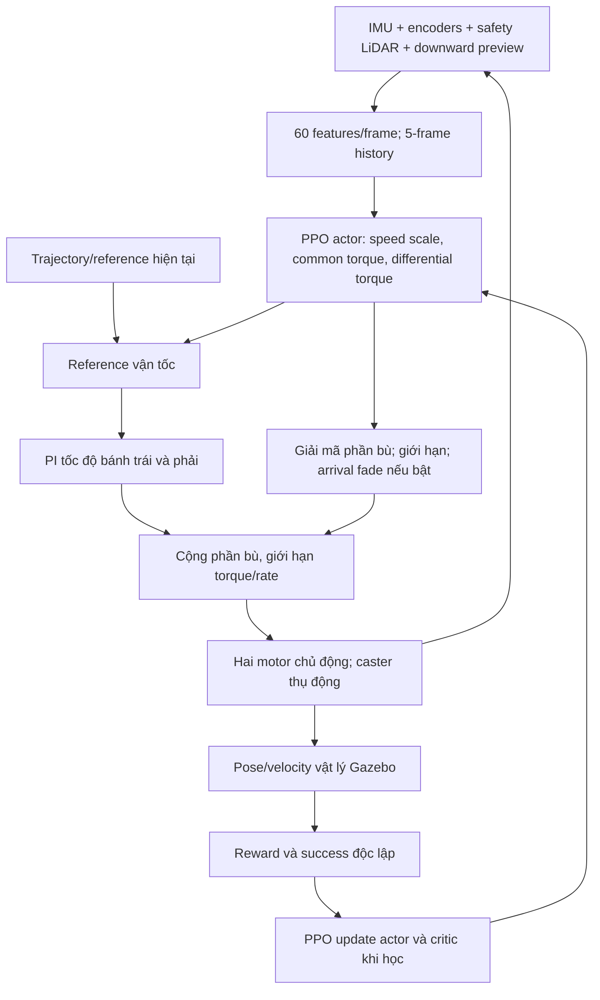
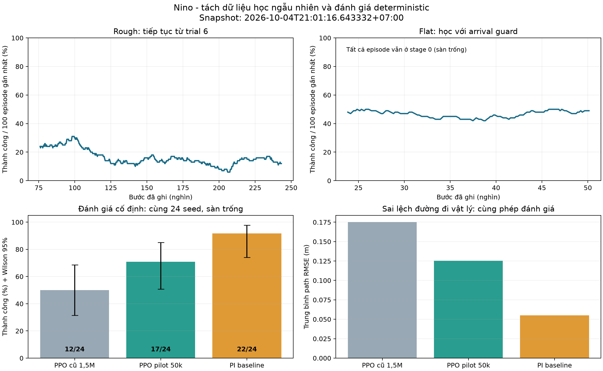

# Báo cáo tiến độ, thuật toán và hướng phát triển RL cho robot Nino

**Ngày:** 04/10/2026. **Mốc dữ liệu cố định:** 21:01:16, giờ Việt Nam/Thái Lan, UTC+7.

Báo cáo dựa trên mã nguồn, cấu hình đã lưu trong từng run, checkpoint, SQLite của Optuna và log episode hiện có. Có phân biệt **kết quả đã đo**, **giải thích có căn cứ nhưng chưa xác nhận nguyên nhân**, và **đề xuất chưa triển khai**. Dữ liệu rough vẫn tiếp tục thay đổi sau mốc trên.

Tài liệu đi kèm:

- [Tổng quan 32 công trình và tài liệu chính thức](rl_research_2026-10-04/literature_review.md).
- [Snapshot số liệu, nguồn và SHA-256](rl_research_2026-10-04/training_snapshot.json).
- [Biểu đồ huấn luyện và đối chứng](rl_research_2026-10-04/training_progress.png).
- [Prompt tiếng Việt để chạy tiếp trong ChatGPT Deep Research](rl_research_2026-10-04/CHATGPT_DEEP_RESEARCH_PROMPT_VI.md).

## 1. Tóm tắt kết quả và quyết định đề nghị

**Dự án đã tiến bộ rõ về mô hình vật lý, cấu trúc điều khiển và cách đánh giá. Chất lượng policy chưa tăng đồng đều, và chưa có bằng chứng RL hiện tại vượt PI trên sàn trống.**

| Hạng mục | Bằng chứng hiện có | Đánh giá |
|---|---|---|
| Policy cable cũ 1,5M | Checkpoint 1.502.803 bước; success trong 500 episode cuối của đoạn log được lưu là 78% | Có kỹ năng cũ để chuyển actor, chưa chứng minh tốt trên robot/map hiện tại |
| Rough sau Optuna | Trial 6 đạt 21/24 trên đánh giá deterministic riêng | Có checkpoint đáng giữ; kết quả chỉ trên geometry/điều kiện đã kiểm tra |
| Rough đang học tiếp | 719 episode, bước ghi cuối 243.142; success 100 episode đầu 24%, 100 cuối 12% | Có dấu hiệu suy giảm trong quá trình học; chưa biết deterministic policy mới có suy giảm tương tự hay không |
| Flat pilot 50k | Đánh giá cùng 24 seed: 17/24, policy cũ 12/24 | Tăng 20,8 điểm phần trăm so với actor cũ trên sàn trống |
| PI baseline sàn trống | 22/24; physical path RMSE thấp nhất trong ba controller | Baseline truyền thống hiện mạnh hơn pilot trên bài test này |
| Flat arrival guard 50k | 105/214 episode học thành công; 99 timeout; stage 0 | Giảm overshoot nhưng chưa giải quyết đến đích đáng tin cậy |
| Ghép hai specialist | World combined đã có; supervisor chuyển policy chưa triển khai | Chưa có kết quả đi toàn course bằng switching |
| Robot thật | Có hướng dẫn triển khai; chưa có dữ liệu thực nghiệm trong tập bằng chứng này | Chưa được phép kết luận sim-to-real thành công |

**Thứ tự nên làm:** giữ checkpoint tốt → xử lý sai lệch định vị và hành vi gần đích → làm flat stage 0 ổn định → thêm cable qua curriculum → kiểm tra specialist rough → triển khai handoff trên combined → kiểm tra địa hình chưa gặp → thử robot thật có giới hạn.

Không nên coi “train lâu hơn” hoặc “Optuna thêm nhiều trial” là lời giải mặc định cho tình trạng hiện tại. Đợt này chỉ đọc log và viết báo cáo, không thay cấu hình hay dừng các tiến trình huấn luyện.

## 2. Bài toán nghiên cứu thực sự của Nino

Mục tiêu hiện tại là robot differential drive đi theo trajectory tham chiếu, duy trì hướng và vận tốc hợp lý khi bánh chủ động/caster gặp hố, gò và cable. Policy dùng tín hiệu cảm biến để điều chỉnh tốc độ chung và phần bù mô-men hai bánh.

Đây là robot có **hai bánh chủ động và hai caster thụ động**. Nó không phải robot hai bánh tự cân bằng. Caster có thể mất tiếp xúc, quay hướng, kẹt ở cable hoặc ảnh hưởng đến trượt; vì vậy mô hình contact và geometry rất quan trọng.

Experiment hiện dùng **đường thẳng cố định**. Nav2 đang tắt. Thành công ở experiment này chưa chứng minh khả năng tự chọn đường trong kho, né mọi vật cản, xử lý đường cong hay thích nghi mọi môi trường.

IMU cho biết thái độ, vận tốc góc và gia tốc; encoder cho biết bánh đang quay; terrain preview giúp phát hiện thay đổi phía trước. Các nguồn này bổ sung nhau. IMU không trực tiếp cho biết hình dạng mọi hố trước khi tiếp xúc, hệ số ma sát chính xác, tải động thực tế hoặc vị trí tuyệt đối XY. Khối lượng trong URDF là thông số physics; chưa có bằng chứng actor được cấp một input tải trọng thay đổi và học nhận dạng mọi payload.

## 3. Dự án đã phát triển như thế nào?

### 3.1. Các mốc có bằng chứng

| Giai đoạn | Thay đổi | Vì sao cần thay đổi |
|---|---|---|
| Tháng 9: nhánh điều khiển trực tiếp | Tách experiment khỏi Nav2; reference `/cmd_vel`, wheel PI và residual PPO | Tập trung nghiên cứu điều khiển bánh/trajectory, giảm số lớp cùng thay đổi |
| Revision 27–30 | Hoàn thiện clock/physics completion, chấm arrival, reward goal-first, challenge tracking, exploration theo action | Tránh timeout giả, goal marker bị cảm biến nhìn thấy, đánh giá sai thời gian hoặc thưởng việc vượt obstacle sai |
| Checkpoint cable cũ | Huấn luyện dài; lưu actor/critic và log, backup 1,5M | Tạo điểm khởi đầu và giữ kết quả có thể kiểm tra |
| Rocky Hall | Làm mesh có mounds/depressions thật; đồng bộ visual/collision | Robot phải tương tác đúng với bề mặt nhìn thấy |
| Combined course | Rough trước, flat cables sau; sửa pothole theo kích thước bánh/caster, làm exit bớt gắt | Tiếp cận task thực tế hơn; hạn chế rollover do geometry quá dốc |
| Điều chỉnh robot | Chassis 2,5 kg; mỗi drive wheel 0,8 kg; LiDAR 1,3 kg và đổi mounting | Thay đổi dynamics, center of mass, contact load và khả năng transfer |
| Tách rough/flat | Hai world, hai config, hai study; ROS domain/partition riêng | Giảm độ khó hỗn hợp, tránh `/clock`/controller can thiệp chéo |
| Flat curriculum | Sàn trống → thêm cable → random góc → adaptive items | Học kỹ năng cơ bản trước task đầy đủ |
| Goal margin | Reference nhằm vào sâu hơn vòng scoring, stop tolerance 0,05 m | Tránh dừng ở rìa khi odometry khác vị trí vật lý |
| Arrival guard | Giảm residual torque trong 0,5 m cuối | Hạn chế policy thắng PI khi PI đã giảm tốc gần đích |

Git có commit `a861939` ngày 30/09 để backup run 1,5M; các commit ngày 22–26/09 ghi nhận cập nhật RL và triển khai Pi. Nhiều thay đổi combined/split hiện nằm trong working tree. Mốc Git không tự bao phủ toàn bộ geometry/config hiện tại; snapshot đi kèm lưu hash những file liên quan.

Tài liệu lịch sử: [revision 30](RL_GOAL_FIRST_REVISION_28.md), [kiểm tra trước huấn luyện](RL_PRETRAINING_CHECK_2026-10-04.md), [arrival guard](FLAT_ARRIVAL_GUARD_2026-10-04.md). Báo cáo tổng quan cũ chứa thông số của thời điểm trước, không dùng nó thay cho `ppo.yaml` của run đang phân tích.

### 3.2. Map hiện nay và vật cản

- **Combined:** rough từ khoảng x=0,8 đến 6,72 m; seam sang nền phẳng x≈6,72 m; sáu cable ở x=7,2–12,0 m; đích x=13 m.
- **Rough riêng:** start x=0, goal x=6,55 m; dùng hệ tọa độ x toàn cục của rough trong combined.
- **Flat riêng:** start x=0, goal x=6,45 m; origin tương ứng x=6,55 m của combined. Origin flat và seam là hai mốc khác nhau.
- Rough có hố thật trong mesh, cùng bề mặt visual/collision. Các adaptive items được spawn trên nền flat là geometry/rim/bump/groove mô phỏng thử thách; không phải mọi item đều là lỗ khoét xuyên floor.
- Moving obstacle đã bỏ theo yêu cầu. Combined cho random góc cable ±30° mỗi episode và adaptive item tối đa 6, lateral spawn trong khoảng ±0,5 m. Flat curriculum giới hạn số và góc theo stage; ở stage 0 hiện không có cable/item.

Xem [preview combined](combined_world_preview.png) và [hai section](split_course_preview.png). Metadata `fixed_terrain_challenges` phục vụ theo dõi vùng thử thách; không được dùng nó thay phép đo mặt mesh hay suy ra actor biết chính xác mọi vị trí hố.

## 4. Kiến trúc hiện tại và cơ chế điều khiển

### 4.1. Thông số robot và timing

| Thông số | Giá trị trong mô hình/cấu hình hiện có |
|---|---|
| Chassis | 2,5 kg |
| Hai drive wheels | 0,8 kg mỗi bánh; radius 0,0625 m |
| LiDAR | 1,3 kg |
| Caster | Radius 0,016 m; mỗi bracket 0,0821604275 kg, wheel 0,0131302038 kg |
| Khoảng cách hai drive wheels | 0,34273666 m |
| Wheel-speed PI | Kp=0,30; Ki=0,10; integral limit=4 |
| Wheel controller | 500 Hz theo simulation time |
| PPO action | 10 Hz danh định |
| Physics | 0,002 s/step; thường 50 physics step cho một action |
| Wheel speed operating limit | 12 rad/s; URDF emergency limit khác, 24 rad/s |
| PI torque limit | 4 N·m; giới hạn tổng software/URDF 12 N·m |
| Torque slew limit | 10 N·m/s |
| PPO residual action limit | 2 N·m cho mỗi residual bánh ở profile hiện phân tích |
| Cruise reference | 0,4 m/s; approach minimum 0,03 m/s |

Tham chiếu: [URDF](../src/nino_description/urdf/nino.urdf.xacro), [effort config](../src/nino_control/config/effort_drive.yaml), [wheel controller](../src/nino_control/nino_control/effort_drive.py).

Gazebo/ROS/physics tiêu tốn CPU; GPU chạy network PPO. `run_metadata.json` của hai run ghi **NVIDIA GeForce RTX 4080**, Python 3.12.3, SB3 2.9.0. Đây là thông tin của máy thực thi run, không lấy tên ThinkPad trong terminal để suy ra GPU khác. Hai world cùng máy vẫn tranh CPU/GPU dù domain đã tách.

Lockstep có barrier chờ physics và dữ liệu. Một số recovery sensor có thể thêm thời gian mô phỏng; reward/episode dùng `dt` thực tế, không giả sử tất cả action luôn đúng 0,1 s. Deadline 30 s mô phỏng khác thời gian máy tính thực chạy.

### 4.2. Luồng cảm biến tới mô-men bánh

Ground truth phục vụ reward/scoring; **không đưa vị trí/velocity vật lý hoặc slip tính từ simulator vào actor**. Critic hiện cũng không có một input privileged riêng. Như vậy deployment không phải cung cấp `/ground_truth/odom` để actor quyết định, nhưng chất lượng estimated observation vẫn là vấn đề.

### 4.3. Policy học gì và điều khiển từng bánh ra sao?

Mỗi frame có 60 features: đường tham chiếu/lookahead, estimated tracking, thông tin bánh, IMU, LiDAR, action trước và terrain preview. Ghép 5 frame thành **300 input**. Preview lấy từ downward GPU lidar 31 ray; actor nhận features preview đã xử lý, không nhận toàn bộ point cloud/elevation map.

[History policy](../src/nino_rl/nino_rl/policies.py) kết hợp frame hiện tại 60, chênh lệch frame gần nhất 60 và temporal CNN 64 → 184 features. Actor MLP 128→128→3; critic 256→128→1, extractor riêng. Không có hidden state RNN kéo dài giữa episode. Chênh lệch frame không phải đạo hàm được hiệu chuẩn nếu thời gian mẫu thay đổi.

Với action đã clip `u=(u_s,u_c,u_d)` trong [-1,1]:

\[
s=(u_s+1)/2,\quad
\tau_{L,res}=2\,clip(u_c-u_d,-1,1),\quad
\tau_{R,res}=2\,clip(u_c+u_d,-1,1).
\]

Speed scale `s` thay đổi reference vận tốc; common torque đẩy/phanh chung; differential torque tạo khác biệt trái/phải. Wheel target được tính từ differential-drive kinematics:

\[
\omega_L^*=(v^*-b\dot\psi^*/2)/r,\qquad
\omega_R^*=(v^*+b\dot\psi^*/2)/r.
\]

Mỗi bánh có PI riêng, sau đó cộng phần bù và áp giới hạn/rate. **Có thể tác động hai drive motors khác nhau**, nhưng qua cấu trúc common/differential và speed scale chung. Đây không phải hai speed controllers hoàn toàn tự do, không giới hạn.

Profile `rocky_tracking.yaml` dùng `yaw_reference`: action thứ ba có ý nghĩa khác với `wheel_torque` của rough/flat specialists. Hai model có cùng 300/3 vẫn không được hoán đổi nếu semantics action khác.

IMU đã có trong observation và penalty. Vì policy dựa trên cảm biến/history, nó có khả năng học phản ứng sau va chạm hoặc nghiêng. Để chứng minh IMU thực sự giúp generalization cần ablation có/không IMU và test địa hình/dynamics chưa train; chưa có kết quả đó.

### 4.4. PPO thay đổi policy trong quá trình học

Actor sinh Gaussian action; lúc train thường sample nên có exploration, lúc evaluation dùng deterministic action. SB3 giữ raw action/log probability cho PPO và clip action khi gửi môi trường; đây không phải tanh-squashed Gaussian.

Mỗi rollout thu thập observation, action, reward, value; GAE ước lượng advantage. PPO cập nhật actor/critic theo objective clipping:

\[
L_{clip}=E[\min(\rho_t A_t,\,clip(\rho_t,1-\epsilon,1+\epsilon)A_t)],
\quad \rho_t=\pi_\theta(a_t|o_t)/\pi_{old}(a_t|o_t).
\]

Có thêm value loss và entropy term. Clipping/KL hạn chế độ lớn update, không bảo đảm task success hoặc mọi metric tăng sau mỗi rollout. Nền tảng: [PPO](https://arxiv.org/abs/1707.06347), [GAE](https://arxiv.org/abs/1506.02438).

**Thay đổi trong run:** trọng số actor/critic, optimizer state, Gaussian std, window curriculum. **Không tự thay trong run hiện tại:** reward formula, robot mass, mesh, vị trí goal, learning rate hằng và những safety thresholds. Curriculum có thể đổi geometry ở reset khi đạt điều kiện; flat hiện chưa đạt.

## 5. Reward, success và những tham số thật sự đang dùng

### 5.1. Công thức chính

[`compute_reward`](../src/nino_rl/nino_rl/control_v2.py) dùng `reward_v2`, không phải mọi weight trong block legacy `reward`. Cấu hình YAML còn chứa thông tin legacy nên đọc tên weight mà không kiểm tra nhánh code có thể dẫn đến kết luận sai.

Đặt `h=dt/0,1`, `d` là khoảng cách endpoint vật lý, `e_y` là lateral error vật lý, `e_psi` là heading error. Positive progress được giảm nếu lệch đường/hướng:

\[
\Delta=d_{t-1}-d_t,\quad q=e^{-(e_y/0.25)^2}e^{-(e_\psi/0.35)^2},
\quad r_p=w_p\Delta\begin{cases}q,&\Delta>0\\1,&\Delta\le0.\end{cases}
\]

Đi lùi vẫn chịu toàn bộ penalty. Lateral/heading sử dụng bình phương chuẩn hóa có cap; nhiều velocity penalties dùng kernel `1-exp(-error²/sigma²)` có chặn. Tổng reward gồm:

- Tiến tới đích, giữ lateral/heading, không stalled.
- Roll/pitch, body rates, va đập IMU; impact tích phân bậc bốn có cap trên cửa sổ cảm biến, có `impact_scale` của môi trường.
- Slip tính từ wheel speed và simulator ground velocity.
- Applied torque effort, saturation, residual effort, torque rate và action smoothness.
- Bám vận tốc/yaw reference chưa nhân speed scale để tránh policy chọn dừng rồi tự xóa tracking error.
- Goal braking, time penalty, challenge entry/clear/goal và terminal success/failure.

Challenge thưởng một lần cho mỗi vùng theo footprint bánh chủ động và chuẩn hóa theo số challenges. Lệnh torque feedback không phải đo dòng điện motor: effort penalty **không đủ để gọi là tối ưu năng lượng điện**.

### 5.2. Tham số của các run được phân tích

Rough phải lấy từ **`rl_runs/rough_specialist/20261004-130935-610775/ppo.yaml`**, không lấy base rough YAML hay `best_trial.yaml` trỏ trial 3.

| Tham số | Rough đang resume trial 6 | Flat pilot/arrival guard |
|---|---:|---:|
| Learning rate | 1,04377×10⁻⁵ | 6,78161×10⁻⁵ |
| Gamma | 0,995 | 0,997 |
| GAE lambda | 0,95 | 0,95 |
| Rollout n_steps | 1.024 | 1.024 |
| Batch size; epochs | 256; 5 | 256; 5 |
| PPO clip; target KL | 0,2; 0,015 | 0,2; 0,015 |
| Entropy coefficient | 0,00206444 | 0,000724925 |
| Progress weight | 7,66605 | 11,73469 |
| Lateral weight | 0,733625 | 0,349864 |
| Heading weight | 0,25 | 0,460993 |
| Impact weight trước impact_scale | 0,0403580 | 0,05 |
| Attitude weight | 0,641290 | 0,5 |
| Slip weight | 0,0976300 | 0,217493 |
| Goal braking weight | 0,15 | 0,188251 |

Các weight chung đáng chú ý: time=0,05; stall=0,5; effort=0,04; residual effort=0,005; torque rate=0,02; saturation=0,03; action smoothness=0,02. Đây là hệ số trong công thức có chuẩn hóa, không so trực tiếp lớn/nhỏ để suy ra ảnh hưởng thực; xem `reward_totals` từng episode.

Success terminal base +100, rồi trừ position/heading quality penalties. On-time bonus **tối đa** +50 và giảm theo `clip((22-elapsed)/22,0,1)`, không phải mọi episode trước 22 s đều được cộng trọn 50. Challenge entry/clear/goal dùng hệ số 2/8/90 có chuẩn hóa. Failure thường -100; off_path -75; timeout -100 trong profile này.

### 5.3. Định nghĩa thành công và kết thúc episode

Rough/flat split dùng **vòng endpoint vật lý radius 0,20 m và heading error ≤20°**. Goal được chấm bằng ground truth; actor/reference dùng estimated pose. Task hiện **không yêu cầu robot dừng** để success. Một số key về speed/tilt/stopped còn trong YAML không có nghĩa chúng đều được kiểm tra ở nhánh success split.

- Deadline: 30 s mô phỏng; target on-time: 22 s.
- Vượt đích theo hướng forward quá 0,30 m khi chưa success → `goal_missed`.
- Lateral vật lý ≥1,0 m đủ 1 s → `off_path`.
- Rollover threshold 35°; collision dựa safety scan/clearance; wrong_direction và navigation_invalid có thời gian giữ.
- Failure có ưu tiên khi trùng điều kiện success. Deadline là failure của nhiệm vụ, không bootstrap như cắt rollout bên ngoài.

Vì log cuối episode có cả estimated và physical metric, không nên nhìn `lateral` nhỏ trong warning rồi kết luận `off_path` sai: estimated và ground-truth tracking có thể khác nhau.

## 6. Kết quả đã cải thiện và những phần chưa cải thiện

Hai panel trên là **episode khi học có sampling action**. Hai panel dưới là **evaluation deterministic cùng seed trên sàn trống**. Không ghép chúng thành một đường success chung.

### 6.1. Policy cũ 1,5M: có học, nhưng task cũ

Checkpoint backup có 1.502.803 bước. `episodes.jsonl.gz` chứa **3.972 episode của đoạn resume**, khoảng bước 1.003.209–1.502.750; không phải toàn bộ lịch sử từ bước 0. Trong đoạn này:

- 500 episode đầu: 204/500 = **40,8%** success.
- 500 episode cuối: 390/500 = **78,0%** success.

Đây là bằng chứng học có ích trên task/config của đoạn cũ. Robot mass, terrain, reward/control contract và đánh giá hiện đã thay đổi. 1,5M chỉ là số tương tác đã có, không phải chứng nhận policy sẽ tốt trên flat/combined mới.

### 6.2. Optuna đã tìm được gì?

| Study | Trial COMPLETE/FAIL | Kết quả đáng chú ý |
|---|---:|---|
| `combined_rough_optuna_fresh` | 16/2 | Trial 3 score cao nhất DB 93,123; trial 6 93,044; cả hai đạt 10/12 success ở tuning eval |
| `combined_flat_optuna_fresh` | 10/1 | Best trial 7 có success 0%, score 7,685 nhờ progress; “best” không đồng nghĩa giải được nhiệm vụ |
| `flat_curriculum_optuna` | 8/1 | Best trial 6 đạt 4/12=33,3% trên tuning stage 1 có một cable; là nguồn hyperparameters cho curriculum |

Split objective hiện là **100×success_rate + 10×progress_fraction − physical_path_RMSE**. Đây là score đánh giá bên ngoài reward train. `FAIL` có thể là lỗi tiến trình/hạ tầng; cần xem log, không gộp với COMPLETE có performance kém. DB vẫn giữ cả kết quả tốt/xấu. Tuner tạo study load-if-exists; sampler dùng cấu hình mặc định Optuna, không có pruning giữa chừng trong split script hiện tại.

Split tuner tìm **9 tham số**: 5 reward weights theo section + learning rate, gamma, n_steps, ent_coef. Nó giữ architecture, action semantics, geometry và success thresholds. Full combined tuner có search rộng hơn khi train từ đầu, nhưng không có cơ sở gọi nó là “tune mọi tham số” hoặc tự thiết kế reward formula. [Optuna](https://arxiv.org/abs/1907.10902) hỗ trợ search/pruning theo chương trình người dùng; [Eureka](https://arxiv.org/abs/2310.12931) là hướng khác, tạo mã reward bằng LLM, chưa tích hợp vào Nino.

### 6.3. Rough: trial 6 tốt hơn ở kiểm tra riêng

| Checkpoint | Success/24 | On-time/24 | Mean physical path RMSE |
|---|---:|---:|---:|
| Rough trial 3 | 15/24 = 62,5% | 11/24 | 0,1565 m |
| Rough trial 6 | **21/24 = 87,5%** | **20/24** | **0,1219 m** |

Tuning DB chọn trial 3 trên 12 episode; tập held-out bổ sung chọn trial 6. Vì đã dùng held-out để chọn model, tập đó hiện đóng vai trò **validation model selection**, không còn là test hoàn toàn chưa nhìn cho công bố cuối. Trial 6 mới khoảng 50.176 bước đã hữu ích, cần giữ bản này dù train tiếp.

### 6.4. Flat: phép đối chứng mạnh nhất hiện có

Cả ba controller dùng cùng benchmark ID, phase 1, geometry clear-floor, domain randomization tắt và seed **50000–50023**. Bảng là mean trên tất cả episode, gồm failure.

| Metric | Actor cũ 1,5M | Flat pilot 50k | Straight PI baseline |
|---|---:|---:|---:|
| Success | 12/24 = 50,0% | 17/24 = 70,8% | **22/24 = 91,7%** |
| On-time success | 12/24 | 17/24 | **22/24** |
| Physical path RMSE | 0,1751 m | 0,1255 m | **0,0549 m** |
| Physical endpoint error | 0,5413 m | 0,2691 m | **0,2184 m** |
| Odom–truth position discrepancy | 0,3767 m | 0,1946 m | **0,1874 m** |
| Vertical acceleration RMS | **1,7367 m/s²** | 2,1512 m/s² | 1,7711 m/s² |

Pilot tăng **20,8 điểm phần trăm**, giảm physical path RMSE khoảng **28,3%** so với old actor. Nhưng PI tốt hơn pilot **20,8 điểm phần trăm** và RMSE thấp hơn khoảng **56,3%**. Pilot cũng không cải thiện vertical acceleration so với old actor. “Cải thiện reward” hoặc “tới đích nhiều hơn” không tự có nghĩa giảm rung/tiết kiệm năng lượng.

Đây là bằng chứng để giữ PI làm baseline và hạn chế RL khi không cần bù. Không phải bằng chứng PID/Nav2 sẽ luôn thắng RL trên rough/cables: chưa chạy so sánh tương ứng. 24 episode và một training seed chưa đủ kết luận tổng quát hay significance. Wilson interval trong hình chỉ mô tả uncertainty của tỷ lệ; episode giữa controller là paired và map cố định.

Nguồn: [old](../rl_runs/flat_old_clear_comparison/20261004-164659-061413/summary.json), [pilot](../rl_runs/flat_pilot_clear_validation/20261004-153537-095341/summary.json), [PI](../rl_runs/flat_clear_pi_comparison/20261004-182112-771935/summary.json).

### 6.5. Arrival guard: sửa failure mode, chưa giải bài toán arrival

Guard dùng **estimated remaining path distance**, không dùng ground truth để can thiệp action:

\[
g=clip((d_{remaining,est}-0.05)/(0.50-0.05),0,1),\quad
\tau_{L/R,res}'=g\tau_{L/R,res}.
\]

Ngoài 0,5 m giữ residual đầy đủ; gần stop point fade về 0; speed scale không đổi. Train và deployment dùng chung decoder. Rough config không có key này nên hành vi không tự đổi.

Hai regression seeds được chọn từ failure cũ, dùng actor chưa học lại, đã success 2/2; chỉ 1/2 đúng target time. Đây là kiểm tra cơ chế có mục tiêu, không phải general success=100%. Các kiểm tra focused được ghi ở [arrival guard note](FLAT_ARRIVAL_GUARD_2026-10-04.md).

Run học guard đã hoàn tất **50.176 bước**, 214 episode:

- Success **105/214=49,1%**; timeout **99**; off_path **10**; goal_missed **0**.
- First100 48%; last100 49%; last30 **15/30=50%**.
- Stage cuối và stage tiếp theo đều **0**. Chưa học qua một cable trong run này.
- Mean physical endpoint error **0,3667 m**; odom–truth discrepancy **0,3161 m**.

Run pilot trước đó success 47,1%, có 61 goal_missed, 50 timeout, 26 off_path. Phân bố failure chuyển từ vượt đích sang timeout; số episode và checkpoint đầu khác nhau nên không quy toàn bộ thay đổi cho guard. Chưa có deterministic 24-seed eval cho **actor sau khi train guard** trong snapshot; không gán kết quả pilot hay 2 regression seeds cho actor mới.

## 7. Rough đang học tiếp: phải xem dấu hiệu suy giảm nghiêm túc

Run resume trial 6 thêm ngân sách 450.000 bước. Snapshot hiện **243.142 bước cumulative được ghi trong episode**, gồm 50.176 bước checkpoint đầu. Final model chưa tồn tại ở mốc capture; chưa thể gọi run 500k đã xong.

| Metric train stochastic | 100 episode đầu run resume | 100 episode cuối snapshot |
|---|---:|---:|
| Success | 24/100 | **12/100** |
| Timeout | 34/100 | **55/100** |
| Goal missed | 42/100 | 33/100 |
| Physical path RMSE | 0,3117 m | **0,3393 m** |
| Physical endpoint error | 0,5218 m | **0,5444 m** |
| Odom–truth discrepancy | 0,5378 m | **0,5689 m** |
| Mean return | -511,4 | **-589,9** |
| Mean episode duration | 25,83 s | **28,11 s** |
| Vertical acceleration RMS | 1,5157 m/s² | 1,4068 m/s² |

Tỷ lệ thành công và reward xấu hơn trong khi rung thấp hơn một chút. Có thể policy đi chậm/cẩn trọng hơn nhưng đến đích kém; cần đọc action/speed và reward breakdown để xác nhận. Current last30 5/30, toàn đoạn resume 123/719=17,1%.

**Đã biết:** train performance gần đây giảm; pose discrepancy lớn; failures chủ yếu arrival/timeout. **Chưa biết:** deterministic policy hiện tại có thật sự mất kỹ năng, exploration có quá lớn, critic update có làm actor lệch hay reward trade-off gây ra gì. Stochastic train 12% không thể so trực tiếp với deterministic evaluation 87,5% để khẳng định giảm 75,5 điểm phần trăm.

Khuyến nghị giữ trial 6 làm checkpoint tham chiếu. Không mặc nhiên chọn checkpoint mới nhất làm deployment model. Trước khi cấp ngân sách tiếp, dùng dữ liệu TensorBoard sẵn có để xem `approx_kl`, `clip_fraction`, entropy/std, explained variance và reward components; đối chiếu checkpoint ở mốc có ý nghĩa với protocol đã khóa, tránh lặp lại evaluation không có câu hỏi cụ thể.

## 8. Những vấn đề cần sửa trước khi train dài hơn

### 8.1. Định vị và điều kiện gần đích

Pose dùng để điều khiển là wheel odometry, còn reward/success chấm vật lý. Bánh quay khi trượt, caster chuyển hướng và contact dynamics có thể làm hai nguồn lệch. Kiểm tra trước đã dựng lại odometry từ joint positions, khớp phép tích phân velocity khoảng vài mm nhưng vẫn khác physical trajectory; chưa xác lập đây là lỗi tích phân đơn giản.

Stop margin và residual fade giúp một số triệu chứng, không sửa nguyên nhân vị trí. Khi estimated pose nói đã đến, reference có thể dừng trong lúc physical robot còn ngoài circle; ngược lại policy có thể vượt hoặc chạy lateral ngoài goal.

**Đề xuất:** kiểm tra frame/timestamp/covariance, calibration wheel radius/separation trong điều kiện ít trượt; fusion encoder–IMU để ổn yaw/motion, và nguồn quan sát vị trí ngoài wheel integration, như LiDAR/map localization phù hợp. IMU+encoder EKF không tự làm XY observable tuyệt đối. [robot_localization](https://github.com/cra-ros-pkg/robot_localization/blob/rolling-devel/doc/configuring_robot_localization.rst), [AMCL](https://docs.nav2.org/rolling/configuration_and_development/configuration_guide/others/configuring_amcl/).

### 8.2. Giữ baseline tốt và giới hạn phần bù

PI rõ ràng mạnh ở clear-floor. Có thể thử residual regularization quanh baseline, giảm exploration std theo action khi actor transfer, torque budget khác theo terrain/arrival, hoặc outer controller bám đường tốt hơn. Tất cả là phương án cần ablation, không khẳng định chắc chắn tăng success.

Actor transfer hiện **copy cả learned `log_std`**. Vì vậy `initial_action_std` trong YAML không bảo đảm std của run init-model thực sự là [0,20; 0,12; 0,05]. Nếu muốn reset/std schedule, cần thay có chủ đích và lưu training contract. Đây là điểm cần kiểm tra trước khi quy stochastic failure cho terrain.

### 8.3. Curriculum phù hợp khả năng

Flat stage 0 chưa đạt gate. Ép lên cable stage sẽ trộn failure arrival với failure vượt vật cản. Có thể học arrival từ khoảng cách ngắn, tăng dần chiều dài; sau đó mới thêm cable. Phải giữ một validation task đầy đủ độc lập để tránh “dễ hóa” metric cuối. Curriculum reverse-start và automatic terrain sampling đã có nghiên cứu liên quan: [Florensa](https://arxiv.org/abs/1707.05300), [VertiSelector](https://cs.gmu.edu/~xxiao2/papers/vs.pdf).

### 8.4. Generalization và sim-to-real

Domain randomization đang **tắt** trong các run/bộ eval chính nêu trên. Ngẫu nhiên góc cable/placement không tương đương random hóa mass, ma sát thật, tải, motor lag, noise, sensor dropout và địa hình mới. Cần phân biệt residual-channel perturbation của một tùy chọn eval với thay đổi vật lý thật.

Policy có history IMU chưa đồng nghĩa “adapt mọi terrain”. Train/test terrain families khác nhau, randomize dynamics vừa đủ sau calibration và đánh giá sensor failure là các bước còn thiếu. [Dynamics randomization](https://arxiv.org/abs/1710.06537), [RMA](https://arxiv.org/abs/2107.04034) là tham khảo, không phải chức năng Nino đã có.

## 9. Curriculum và huấn luyện sẽ tiếp tục như thế nào?

### 9.1. Cơ chế 16 stage flat đã triển khai

| Stage | Geometry episode |
|---|---|
| 0 | Sàn trống, không cable/adaptive item |
| 1–6 | Tăng từng cable tới đủ 6; góc gần thẳng ±2° |
| 7–9 | Đủ 6 cable; góc tăng ±10°, ±20°, ±30° |
| 10–15 | Đủ 6 cable ±30°; adaptive items tăng 1 tới 6 |

Cửa sổ **30 active-stage episode**, success ≥75% → thực tế cần ít nhất **23/30**. Khoảng 20% episode có replay stage trước, replay không tính gate của stage hiện tại. State/window lưu trong checkpoint. Stage 1 bắt đầu cable index 2, x=2,45 m của flat riêng.

Run guard kết thúc với 15/30, chưa đạt 23/30. Tiếp tục bằng resume đúng contract sẽ giữ stage/window và trọng số; không tự lên stage do đủ số steps.

### 9.2. Roadmap theo tiêu chí hoàn thành

| Chặng | Công việc tiếp theo | Tiêu chí ra khỏi chặng đề nghị |
|---|---|---|
| A. Arrival/localizer | Dùng log hiện có phân loại timeout, pose error, residual authority; sửa một nguyên nhân mỗi lần | Clear-floor ổn định, failure vật lý được giải thích; không có việc estimated arrival nhưng truth chưa đến |
| B. Flat specialist | Train từ actor đã chọn, curriculum khoảng cách nếu cần; sau đó 16 stage cable/item | Gate đã đạt với protocol không bị nới; held-out đầy đủ cable tốt, không chỉ stage 0 |
| C. Rough specialist | Giữ trial 6; kiểm tra divergence train/eval, action std và arrival; thay đổi có kiểm soát | Không kém checkpoint tham chiếu trên metric success/tracking; có test terrain mới |
| D. Switching | Viết supervisor và reference cho một mission 13 m; hai actor frozen | Handoff không stop/jump command, hoàn thành toàn course; so với single policy và baseline |
| E. Generalization | Unseen potholes/cables, tải/traction/delay/noise, đường cong | Metric và degradation được báo cáo theo từng điều kiện; không trộn train/test seeds |
| F. Hardware | Hiệu chuẩn actuator/sensor/localization, đo Pi latency, thử ngắn có giới hạn | Sensor contract tương đương, torque/speed đúng units, kết quả thật có raw log |

Đây là roadmap đề xuất, không phải các chặng đã tự động chạy. Mốc 500k/1,5M không thay tiêu chí chất lượng. Thời gian hoàn thành còn phụ thuộc tốc độ mô phỏng và số iteration sửa lỗi; chưa có cơ sở hứa lịch cố định.

### 9.3. Resume, chuyển actor và sản phẩm sau training

- **Resume:** cùng task/control contract; giữ actor, critic, optimizer, cumulative steps và curriculum state. Thay reward/goal/action decoder có thể bị contract check từ chối.
- **Init-model:** chuyển actor và learned exploration std nếu architecture/action semantics tương thích; critic/optimizer mới, step/stage khởi tạo lại. Đang áp dụng ở flat guard.
- **Sản phẩm:** checkpoint `.zip`, config đã resolve `ppo.yaml`, metadata, episode/trajectory logs và TensorBoard. Policy inference không tiếp tục học online nếu không chạy trainer.
- Old 1,5M có thể là actor initializer cho wheel_torque 300/3 tương thích; old 54/2 hoặc Rocky yaw_reference không dùng cùng nghĩa action. Không “merge trọng số” hai specialist để tạo policy giỏi cả hai.

## 10. Ghép hai policy trong combined world: thiết kế dự kiến

**Có thể sử dụng hai kết quả riêng bằng switching, nhưng code supervisor này chưa tồn tại trong kết quả đã kiểm tra.** Combined world chỉ cung cấp geometry, không tự tải hoặc chuyển checkpoint.

Luồng dự kiến:

1. Start dùng rough actor đã chọn, đường tham chiếu mission tiếp tục tới goal x=13; không coi x=6,55 là terminal goal để rough brake/dừng.
2. Dùng estimated pose đáng tin và vùng handoff gần seam; thêm latch/hysteresis để không bật qua lại do drift.
3. Flat actor thấy hệ tọa độ/reference tương thích local flat: offset x=6,55 m được xử lý trong observation adapter; không reset physical robot hay `/odom`.
4. Cần xem lại remaining-distance, lookahead, previous action/history và feature ranges: rough actor từng học tới local goal, chuyển sang mission khác gây distribution shift. Không chỉ thay filename model.
5. Một publisher torque duy nhất; transition giới hạn tốc độ biến thiên, giữ PI ổn. Nếu thử blending phải blend lệnh có cùng semantics và đo tính ổn định.
6. Policy frozen khi kiểm tra end-to-end; đánh giá success toàn mission, handoff error và chênh torque, rồi mới cân nhắc train transition.

Fixed-position switching trong map đã biết là một supervisor thiết kế tay. Nhận dạng terrain để chọn policy ở map khác là bài toán bổ sung. Phân cấp/options đã có tiền lệ [Option-Critic](https://arxiv.org/abs/1609.05140), [wheeled-legged hierarchy](https://arxiv.org/abs/2405.01792); không gọi handoff theo x là một thuật toán hierarchical RL mới.

## 11. So sánh với PID, Nav2 và những phương pháp liên quan

### 11.1. Cần so đúng lớp chức năng

**PID/PI là controller; Nav2 là navigation framework gồm nhiều lớp.** Cấu trúc khả thi sau này: Nav2 planner/local controller → reference v/ω → wheel PI → residual terrain policy → motor. Hiện experiment chỉ có reference thẳng; chưa tích hợp chuỗi này và policy chưa chứng minh bám arbitrary path. [Nav2 servers, Jazzy](https://docs.nav2.org/jazzy/getting_started/navigation_concepts/navigation_servers/).

| Phương pháp | Vai trò và điểm mạnh | Giới hạn liên quan Nino | Trạng thái bằng chứng Nino |
|---|---|---|---|
| Wheel PI hiện tại | Theo tốc độ từng bánh, đơn giản, ít compute | Encoder không biết toàn bộ motion vật lý; không tự dự đoán pothole | Đã đo clear-floor 22/24 |
| Outer PID bám đường + wheel PI | Dùng lateral/heading feedback; dễ chẩn đoán/tune | Cần localization tốt; thiết kế/tune cho contact mạnh | Chưa có benchmark outer PID đầy đủ |
| Pure Pursuit/RPP + PI | Reference theo geometry path, regulation speed/collision | Không tự bù wheel unloading, caster contact; phụ thuộc costmap/pose | Chưa đo với cùng Nino course |
| DWA/DWB | Chọn local motion theo constraints/cost/collision | Costmap 2D và velocity command chưa giải contact terrain 3D | Chưa đo |
| TEB | Tối ưu timed trajectory, nonholonomic constraints | Terrain dynamics cần mô hình/cost bổ sung; không tự residual torque | Chưa đo; không mặc định mọi bản plugin có trong Jazzy |
| MPC/MPPI | Predictive motion, tối ưu cost và constraints online | Motion model/cost phải phù hợp; CPU latency cần đo | Chưa đo |
| PPO residual Nino | Bù từ history IMU/encoder/preview, tác động hai bánh | Sampling đắt, reward trade-off, drift observation, overfit | Pilot hơn old actor nhưng kém PI clear-floor |
| SAC residual | Off-policy replay có thể tiết kiệm interaction | Cần triển khai/tune/eval mới; không sửa lỗi task | Chưa triển khai |
| RMA/latent adaptation | Học trạng thái động học từ history | Cần latent-training/randomization riêng, transfer architecture | Chỉ là hướng tham khảo |
| Hai specialist + supervisor | Chuyên môn hóa rough/flat | Handoff và reference distribution shift có thể làm hỏng mission | Chưa triển khai switching |

Nguồn kỹ thuật: [robust PID](https://www.sciencedirect.com/science/article/pii/S0967066101000661), [RPP](https://arxiv.org/html/2305.20026v1), [DWA](https://publications.ri.cmu.edu/the-dynamic-window-approach-to-collision-avoidance), [TEB](https://www.sciencedirect.com/science/article/pii/S0921889016300495), [MPPI chính thức](https://docs.nav2.org/rolling/configuration_and_development/configuration_guide/controller_plugins/mppi_controller/configuring_mppic/), [SAC](https://arxiv.org/abs/1801.01290). Chi tiết mức tiếp cận nguồn trong danh mục; bảng này là đối chiếu chức năng, không phải kết quả head-to-head các thuật toán trên Nino.

### 11.2. Thiết kế đối chứng công bằng cho nghiên cứu tiếp

Giữ cùng robot/mass/contact, geometry, initial poses, localization, motor limits, target speed/deadline và goal circle. So tối thiểu:

1. PI thẳng đang có, dùng như sanity baseline.
2. Outer path-tracking PID + wheel PI.
3. Nav2 RPP + wheel PI; sau đó MPPI nếu cần obstacle/local planning.
4. PPO residual cùng reference/localizer.

Tách **clear / rough / cables / combined**. Nếu so tránh vật cản, mọi controller phải được cấp cùng thông tin/mục tiêu; nếu so vượt cable/hố, không để costmap chỉ một phương pháp coi obstacle traversable. Báo cáo success, on-time, physical path RMSE/P95, endpoint, tilt/impact, slip, torque/rate, wall time và inference latency. Thêm năng lượng điện chỉ khi có mô hình/đo công suất phù hợp.

Ablation có mục tiêu: PI vs PI+RL; có/không IMU; có/không preview; một frame vs history; có/không curriculum; guard on/off với actor cố định; single actor vs switching. Khi đánh giá thuật toán học, cần nhiều training seeds, đề nghị ít nhất 3 khi ngân sách cho phép; episode test phải tách khỏi seed đã dùng chọn best trial. Đây là kế hoạch kiểm chứng, không yêu cầu chạy lại ngay các kiểm tra đã đủ cho câu hỏi arrival. [Khuyến nghị về tái lập RL](https://arxiv.org/abs/1709.06560).

## 12. Nino giống và khác các nghiên cứu gần nhất ở đâu?

| Công trình | Điểm đã tồn tại trong nghiên cứu trước | Khác biệt của Nino và phần còn thiếu |
|---|---|---|
| Xu–Pan–Xiao 2024 | PPO, curriculum rough terrain, điều khiển tốc độ/góc lái qua PID, có real V4W | Nino wheel/caster nhỏ, residual torque differential, temporal history/preview; chưa có real verification |
| VertiSelector 2025 | Automatic curriculum chọn terrain bằng TD-error learning potential | Nino stage/gate theo success định trước; có thể học cách đa dạng terrain sampling |
| Residual RL/RPL | Feedback/MPC cộng learned residual | Nino là ứng dụng cho caster/pothole/cable; cần chứng minh phần bù hữu ích hơn baseline |
| RMA/perceptive locomotion | Adaptation và sensor fusion trong policy, history/perception | Nino chưa có latent adaptation module hay attention/recurrent robustness như các hệ đó |
| Wheeled-legged hierarchy | Điều khiển phân cấp navigation–locomotion, thực nghiệm rộng | Nino không có chân; switching chưa có và chưa đi mission combined |

Nguồn: [wheeled terrain RL](https://arxiv.org/html/2409.02383v2), [VertiSelector](https://cs.gmu.edu/~xxiao2/papers/vs.pdf), [Residual RL](https://arxiv.org/html/1812.03201v2), [RPL](https://arxiv.org/abs/1812.06298), [RMA](https://arxiv.org/abs/2107.04034), [perceptive locomotion](https://arxiv.org/abs/2201.08117), [hierarchical wheeled-legged navigation](https://arxiv.org/abs/2405.01792).

Bài warehouse người dùng gửi đề xuất **Dijkstra + PPO**, tập trung navigation/layout. Nino nghiên cứu wheel–terrain control theo reference đã biết. Bài ghi accuracy 96,42%, nhưng chưa đủ protocol/action/reward/seed/raw trajectory để chuyển số đó thành success tương đương Nino. Không so 96,42% của bài với 70,8% Nino để xếp hạng. [Bài warehouse](https://arxiv.org/abs/2411.06128).

### 12.1. Có gì có thể trở thành contribution riêng?

**Ứng viên contribution**, chưa được chứng minh mới tuyệt đối:

- Benchmark caster-supported AMR có true potholes/gentle mounds nối cable course, geometry cùng collision/visual và contact challenges theo kích thước bánh.
- Đánh giá residual wheel torque từ IMU/history/preview bằng **pose vật lý độc lập**, làm rõ trường hợp wheel odometry báo tốt nhưng robot đi sai.
- Terrain-dependent residual authority và specialist handoff có bounded transition, giữ controller truyền thống khi nó đã tốt.
- Đánh giá quality/sampling cost/inference cost dưới tài nguyên ROS–Gazebo và triển khai Pi, nếu có số đo tái lập.

Một câu hỏi nghiên cứu có thể dùng: **“Residual torque policy dựa trên cảm biến và lịch sử có cải thiện tracking và vượt pothole/cable của AMR có caster so với PI/PID/Nav2 reference, trong khi giữ arrival accuracy và chi phí inference phù hợp không?”**

Hiện câu trả lời còn mở: clear-floor chưa hơn PI; chưa có unseen-terrain/hardware/switching results. Không nên viết “đầu tiên”, “độc nhất” hoặc “thích nghi mọi địa hình” dựa trên lần tra cứu này. Để claim contribution thuật toán cần ablation, baseline mạnh và kiểm tra prior art rộng hơn đúng subproblem.

## 13. Vai trò Laya, TensorBoard và ChatGPT Deep Research

### 13.1. Laya/TensorBoard

TensorBoard hiển thị log metrics PPO/episode. Laya monitor hiện tổng hợp episode và có classifier/khuyến nghị; **không điều khiển bánh, không tự sửa reward, không thay actor và không quyết định stage** trong code đang kiểm tra.

Process snapshot có monitor rough trỏ `combined_rough_optuna_fresh`, không phải run `rough_specialist` đang học. Có log flat guard nhưng không thấy flat monitor chạy lúc kiểm tra. Vì vậy không coi mọi label Laya là phản ánh live trainer. Confidence chưa được calibration cho task Nino; khi label và counts mâu thuẫn, lấy raw episode/termination làm căn cứ. Muốn dùng Laya làm decision agent cần thiết kế quyền hành động, evaluation và logging riêng.

### 13.2. Kết nối ChatGPT

Trong phiên này, kiểm tra kết nối trả về **không có browser session và không có công cụ gọi ChatGPT Deep Research**. Plugin search không tìm thấy Deep Research connection; không có một Deep Research job riêng đã được khởi chạy. Phần literature ở đây được thực hiện trực tiếp qua nguồn gốc và PDF người dùng.

Đã chuẩn bị [prompt Deep Research](rl_research_2026-10-04/CHATGPT_DEEP_RESEARCH_PROMPT_VI.md). Có thể mở ChatGPT, chọn Deep Research nếu tài khoản/workspace cung cấp, đính kèm báo cáo và danh mục rồi chạy prompt. Sau khi có kết quả, đối chiếu lại với source/evidence hiện có, đặc biệt tính mới và fair baselines. Tính năng phụ thuộc quyền truy cập tài khoản/workspace. [Hướng dẫn chính thức](https://learn.chatgpt.com/docs/web-search).

## 14. Phạm vi kiểm tra, tái lập và giới hạn

- Không chạy thêm robot evaluation để viết báo cáo. Phân tích lại dữ liệu đã có, đọc source/config/DB/checkpoint và truy cập tài liệu nghiên cứu.
- Snapshot khóa bytes log và hash lúc đọc; rough process có thể ghi tiếp sau đó. Bước ghi cuối episode khác bước đang chạy hoặc checkpoint gần nhất.
- Script [capture_evidence.py](rl_research_2026-10-04/capture_evidence.py) dùng read-only SQLite và log, tạo JSON/figure. Chạy lại sẽ thay snapshot; lưu bản cũ nếu muốn so theo thời gian.
- Biểu đồ đã được render và kiểm tra nhãn tiếng Việt. Không có training-code change cho yêu cầu báo cáo này.
- Chưa đo Nav2/PID outer/MPPI trên cùng robot course, chưa có 3 training seeds, unseen-map suite hoặc kết quả robot thật.
- 32 công trình là tập tài liệu phù hợp được chọn; không tuyên bố bao quát mọi bài. Một số nguồn chỉ đọc abstract/indexed excerpt; phân biệt rõ trong literature review.

**Kết luận:** nền tảng mô phỏng và cơ chế đánh giá đã tốt hơn đáng kể. Pilot flat cải thiện actor cũ, rough trial 6 là điểm tham chiếu tốt. Tuy nhiên arrival/localization và quá trình train rough tiếp vẫn là điểm nghẽn; flat mới chưa rời stage 0. Bước có giá trị cao nhất lúc này là làm rõ và sửa các failure đó, rồi xây dựng bằng chứng specialist/handoff/generalization, thay vì tăng số bước trước khi biết vì sao policy thất bại.
