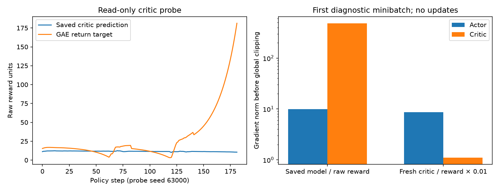

# Flat critic and impact reward correction — 2026-10-10

## Status

Inspection is complete. Following authorization, the scale-only pilot started
on CUDA at approximately **06:07 on 2026-10-10 (Asia/Bangkok)**. The aligned-impact
pilot is queued to run after the scale-only training and matching PI evaluation
finish successfully. Existing Optuna histories, models and frozen source assets
are preserved.

The sequential supervisor records progress in
`rl_runs/flat_reward_validation_v1/status.json` and `supervisor.log`. It will
automatically save `comparison.json` and `REPORT.md` there after both pilots and
their 24-seed PPO/PI evaluations complete. It verifies the same actor, exact
20,480-step budgets, fresh critic/optimizer evidence and fixed objective, and
includes critic curves plus paired scenario uncertainty. It stops the sequence
on execution failure; no new Optuna study or longer training starts automatically.

Supervisor PID at launch: **34251**. The scale-only worker PID is **33190**.

Source actor: `rl_runs/flat_targeted_actor_pilot_v1/train/20261010-002632-975129/nino_ppo_final.zip`
(20,480 steps, SHA256
`370a21320cc65206bfcd1db30b1c8535a8f822639b0ea964cca6ef7453b06668`).
The new profiles copy this pilot's complete actor without
resetting its heads and create a fresh critic, optimizer and timestep counter.

## Why the completed pilot was not promoted

These are matching 24-seed results (63000–63023), with independent physical
arrival scoring. Both methods reached 24/24 goals and cleared both cables.

| Metric | PI | Completed PPO pilot |
|---|---:|---:|
| Mean completion, s | 17.53 | 18.20 |
| Physical path RMSE, m | 0.0288 | 0.0359 |
| RMS vertical acceleration, m/s² | 2.735 | 3.658 |
| Mean episode peak vertical acceleration, m/s² | 65.90 | 89.94 |
| RMS wheel slip | 0.1915 | 0.1895 |
| Fixed evaluation score, higher is better | 23.575 | 21.161 |

The small slip improvement did not compensate for worse tracking and vibration.
Earlier evaluations use different seeds; absolute vibration across those sets
does not establish a controlled improvement.

## Critic diagnosis

Saved TensorBoard learning curves show explained variance near zero/negative
and value losses around 1,500–2,000. The final logged explained variance is
approximately −0.0125 and value loss 1,547.

A read-only probe ran three **stochastic** episodes, seeds 63000–63002, using the
saved actor. It captured 547 transitions, performed no optimizer steps, and
verified that the source checkpoint hash was unchanged. All three arrived.
GAE return targets were reconstructed with the model's gamma 0.997 and lambda
0.95, with terminal boundaries and no cross-episode bootstrap.

- Predicted values: mean **11.56**, standard deviation **0.484**.
- GAE targets: mean **30.24**, standard deviation **35.44**, range **0.96–185.70**.
- Explained variance: **−0.0175**.
- Critic gradient norms across three diagnostic minibatches: **337–485**.
- Actor gradient norms: **4.4–26.4**.
- Global gradient clipping at 0.5 retained only **0.103–0.148%** of each total
  gradient's magnitude.

The installed PPO implementation normalizes advantages, uses unnormalized
critic MSE, combines actor and critic losses, and clips all parameter gradients
together. The critic therefore can suppress the actor update through global
clipping even though their feature extractors are separate. This matches
[SB3 PPO's documented advantage normalization and gradient limit](https://stable-baselines3.readthedocs.io/en/master/modules/ppo.html).

This is a small probe under the final policy, **not a reconstruction of the
historical training minibatches**. It demonstrates a numerical imbalance;
it does not establish the sole cause of the performance gap.

An additional no-update check used the actual proposed initialization: the same
actor, a fresh critic and rewards multiplied by 0.01. Critic gradient norms were
**0.59–1.10**, versus actor norms **7.75–23.67**; global clipping retained
**2.11–6.39%**. Initial explained variance remained poor (−0.289), as expected
for an untrained critic. Scaling units **does not itself improve explained
variance or prove critic convergence**. The diagnostic's separate uniformly
rescaled-value calculation is only sensitivity analysis; the fresh-critic check
is the relevant initialization comparison.



## Impact reward diagnosis and correction

The old impact statistic integrates
`min((abs(vertical_acceleration) / 2) ** 4, 81)` over timestamped samples.
It saturates above **6 m/s²**, so it cannot distinguish larger spikes. Fixed
phase 1 also applies the old environment's impact multiplier of 0.25.

For the saved matching evaluations, the old impact cost is **lower for PPO**,
despite PPO's higher measured vibration:

| Mean positive cost per episode | PI | PPO |
|---|---:|---:|
| Old clipped impact cost | 1.497 | 1.373 |
| Proposed acceleration-energy cost | 5.562 | 8.848 |
| Proposed episode-peak cost | 0.824 | 1.124 |

These proposed costs are **offline repricing of the same outcomes**, not a
new trained policy result. Energy was reconstructed as duration × RMS², assuming
full window coverage under the frozen profile.

The opt-in aligned profile uses the evaluator's existing timestamped,
gravity-compensated vertical-acceleration windows:

```text
energy_cost = impact_weight × integral(az² dt) / (3² × 0.1)
peak_increment_cost = 0.25 × max(0, window_peak − previous_episode_peak) / 20
```

Both costs are subtracted from reward, without the old saturation or phase
attenuation. Peak increments charge each new episode maximum once; their sum is
0.25 × final episode peak / 20. The existing reset clears that maximum.
Energy is proportional to duration × RMS², **not the evaluator's whole objective
or duration-normalized RMS alone**. Keeping time cost and completion gates is
necessary when interpreting slower policies.

Progress, arrival, challenge, tracking, time, slip and other reward terms retain
their selected values. The terminal arrival bonus remains 100, the complete
challenge-at-goal bonus remains 90, and failure precedence is preserved.

## Two profiles to separate the questions

1. `combined_flat_value_scaled_pilot.yaml`: keep the old task reward and give
   PPO **raw reward × 0.01**. This isolates the learner-unit correction with a
   fresh critic/optimizer.
2. `combined_flat_energy_scaled_pilot.yaml`: use the same multiplier and replace
   the impact cost with the energy/peak terms above.

The wrapper is placed **after Monitor**. Episode return, physical measurements
and evaluation scores remain in raw task units; only PPO's learned returns and
value loss use scaled units. No observation normalization, running reward
statistics or clipping are introduced. New TensorBoard `critic/*` metrics expose
prediction/target means, dispersion, ranges, pre-update MSE and explained variance.

New learner contracts use revision **38**. Incompatible optimizer resumes are
rejected. Code changes live in per-experiment package snapshots; the ongoing
rough study and historical flat package files are not changed.

## Next controlled run

Run the **scale-only pilot first**. It copies the completed pilot actor into a
fresh critic/optimizer, trains exactly **20,480 steps**, and then automatically
evaluates PPO and PI on matching fresh seeds **64000–64023**. The helper launches
and closes its own headless Gazebo on domain 79/partition `nino_flat_79`, checks
the frozen assets/controller profile, and refuses another active flat instance.

```bash
cd ~/ninorobot
source /opt/ros/jazzy/setup.bash
source .venv/bin/activate
source install/setup.bash

python src/nino_rl/scripts/run_flat_reward_pilot.py \
  --config src/nino_rl/config/combined_flat_value_scaled_pilot.yaml \
  --run
```

Inspect its critic diagnostics and matching comparison before extending training.
To compare reward meaning, run the aligned-impact profile under the same budget
and starting actor; **do not initialize it from the scale-only pilot**:

```bash
python src/nino_rl/scripts/run_flat_reward_pilot.py \
  --config src/nino_rl/config/combined_flat_energy_scaled_pilot.yaml \
  --run
```

Omitting `--run` only prepares/checks the profiles. Use this helper: the original
`ros2 run nino_rl train` code does not implement these opt-in settings.

Geometry, controller/estimator, two action meanings, physical success criteria,
PPO update settings and fixed evaluation objective stay fixed. Promotion requires
24/24 physical arrivals, mean completion ≤18.5 s, physical RMSE ≤1.05× matching
PI, and ≥10% improvement in vibration or slip with no regression in the other.
This remains a single training-seed pilot; independent training seeds are needed
before claiming repeatable improvement. No new Optuna study is started here.

## Verification and evidence

**17 focused tests passed.** Checks cover energy response above the old saturation threshold,
timestamp partition invariance, one-time peak charging, invalid measurements,
raw Monitor preservation, terminal reward/failure precedence in the executable
snapshot, incompatible resume rejection, terminal GAE boundaries and actor
initialization. Both prepared snapshots compile and their plans verify the
original frozen assets and unchanged physical benchmark identity.

- [Audit JSON](flat_reward_critic_diagnostic_2026-10-10/audit.json)
- [Read-only probe data](flat_reward_critic_diagnostic_2026-10-10/probe.npz)
- [Completed pilot report](FLAT_SPEED_YAW_TARGETED_PILOT_2026-10-10.md)
- `rl_runs/flat_value_scaled_pilot_v1/pilot_plan.json`
- `rl_runs/flat_energy_scaled_pilot_v1/pilot_plan.json`
