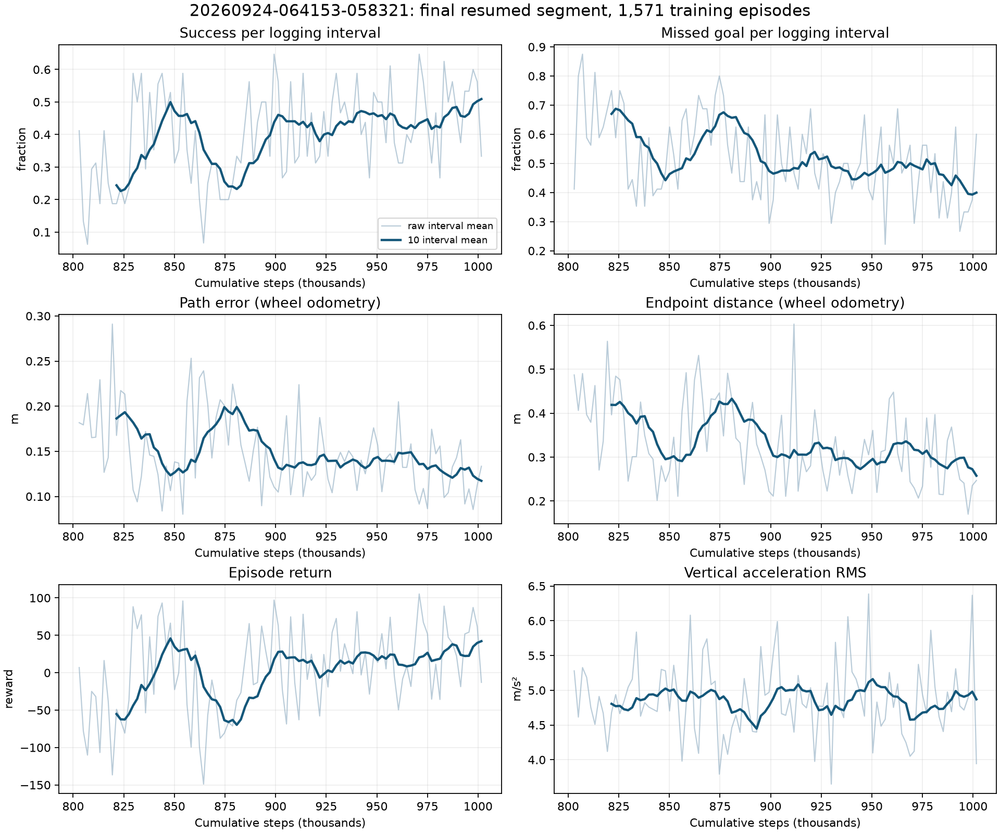
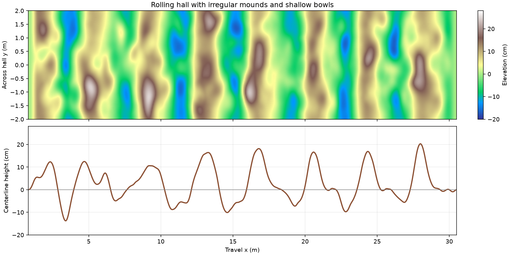
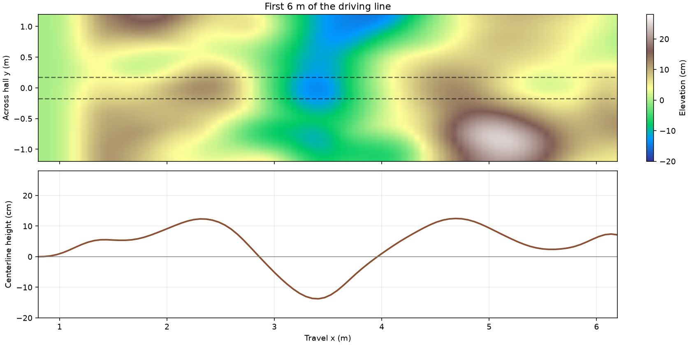

# Rocky terrain tracking: diagnosis and new experiment

The old model improves, but goal capture remains unreliable. The new experiment
keeps the 6 m route and original 4 m clear hall width and trains steady travel
over continuous uneven ground. It uses physical simulation pose for scoring, sensor
observations for the policy, and yaw commands that the wheel-speed controller
can follow. The original world, configuration, and trained weights remain available.

## Evidence from the old run

Source: `rl_runs/20260924-064153-058321`, a resumed segment ending at 1,001,634
steps. There are 98 episode logging intervals, starting at step 802,978, and
1,571 complete episodes. The values below compare means of the first and last
20 logging intervals; they are not equally weighted episode averages.

| TensorBoard metric | First 20 | Last 20 |
|---|---:|---:|
| Success | 32.5% | 46.5% |
| Missed goal | 59.4% | 45.0% |
| Path RMSE, wheel odometry | 0.168 m | 0.123 m |
| Endpoint distance, wheel odometry | 0.388 m | 0.276 m |
| Episode return | -23.4 | 30.4 |
| Vertical acceleration RMS | 4.87 m/s² | 4.82 m/s² |
| Challenge clearance | 94.4% | 94.8% |
| PPO approximate KL | 0.0142 | 0.0184 |
| PPO explained variance | 0.763 | 0.746 |



Episode outcomes are 630 successes, 815 missed goals, 89 off-path exits,
31 timeouts and 6 wrong-direction failures. The last 100 episodes have 48
successes. Successful episodes average 0.045 m path RMSE; missed-goal episodes
average 0.187 m. The records do not contain the old model's physical XY path,
so these errors cannot establish its actual world-frame tracking accuracy.

All 112 scalar tags, their ranges, and first/last window means are exported in
[training_analysis.json](rocky_training_analysis/training_analysis.json).
Reproduce the report and plot with:

```bash
.venv/bin/python src/nino_rl/scripts/analyze_run.py \
  rl_runs/20260924-064153-058321 --output docs/rocky_training_analysis
```

## Faults and constraints

1. **The scoring pose can disagree with physical motion.** The old environment
   uses wheel odometry for path reward and goal checks. Rough-ground slip makes
   this a questionable optimization target. Earlier stone-bed baseline checks
   measured roughly 9 cm mean endpoint disagreement between odometry and
   physical pose, even though the physical path was almost straight. New rocky runs use
   ground-truth pose only for reward, progress, off-path and finish checks.
   Actor inputs remain wheel odometry, IMU, encoders, scans and action history.
   TensorBoard now records both paths. This diagnoses a measurement limitation;
   it does not retrospectively prove the old robot's physical drift.

2. **The hardest phase weakens the comfort objective.** `ros_env.py` derives
   impact scale from the cable phase index: phase 1 gives 0.25, while phase 6
   gives 1.0. Thus the hardest cable receives the weakest impact cost. The new
   profile explicitly uses `impact_scale: 1.0` on its fixed terrain.

3. **The old steering channel competes with the PI wheel-speed loop.** The
   controller requests equal wheel speeds, then PPO adds differential torque.
   The velocity feedback opposes that differential motion. This is an
   architectural conflict visible in the code; its share of the old failure
   rate has not been isolated experimentally. The new action is
   `[speed scale, common torque, yaw reference]`. The PI loop receives the yaw
   target; common torque is limited to ±0.3 N.m per wheel. Existing torque
   steering remains the default for old configurations.

4. **The speed reference ignores the small caster limit.** Drive wheels have
   radius 62.5 mm; casters have radius 16 mm and configured speed limit 30 rad/s.
   The old 0.75 m/s reference needs 46.9 rad/s at the caster. The new 0.4 m/s
   reference needs 25 rad/s. This is a kinematic inconsistency in the old
   configuration; the old logs do not prove whether passive-joint limiting
   was the cause of any particular impact or miss.

5. **The old objective emphasizes precise arrival.** A 0.10 m endpoint circle,
   heading within 12 degrees, forward-only approach, and failure after 0.30 m
   overshoot leave limited recovery. Goal success earns +100 plus up to +90
   challenge bonus and +50 time bonus. Mean return is +231 for success versus
   -131 for missed goals. Challenge clearance is already around 95%, while
   impact RMS barely improves. For the requested traversal task, the new
   objective uses dense aligned progress, lateral/heading costs, impact and
   action smoothness, a +5 completion reward, and -15 failure penalty. It
   removes obstacle-touch and arrival-speed bonuses. Standing still has a
   negative reward and cannot earn forward progress.

6. **PPO is learning, but the charts do not prove convergence.** Explained
   variance remains around 0.75, and KL/clip fraction are finite. There is no
   evidence here of a broken PPO probability calculation or exploding update.
   Large value losses partly reflect large unnormalized returns. Retain PPO;
   the new profile reduces reward magnitude and starts with a 1e-4 learning
   rate and five epochs. These are conservative starting settings, not a
   demonstrated optimum. Action-clipping frequency is now logged.

The new finish criterion is explicitly different: cross the line at x=6 m
within ±0.20 m lateral error and 20 degrees heading error, before x=6.30 m.
It is a traversal gate, with no docking maneuver. The 30 s deadline gives the
initial 0.8 speed-scale policy enough time for approximately 19 s of driving.
This task's success rate must not be directly compared with the old docking
success rate as evidence of policy improvement.

## Terrain and caster clearance





- Original enclosure footprint: x=-2 to 32 m, y=-2 to 2 m; width 4 m.
  The walls extend 0.3 m below the old floor to contain the new valleys.
- Start (0,0), goal (6,0), both unchanged.
- One continuous 513 × 513 sampled terrain spans x=0.8 to 30.5 m across the
  full 4 m width. Gazebo uses the same mesh for collision and rendering, so
  the contact surface follows the visible dips and rises. A PNG of the sampled
  heights is also exported for inspection. The spawn and far end join level
  floor sections smoothly.
- Broad rolling hills combine with 12 side patches and 15 route patches.
  Another 128 irregular features cover the hall, including one near the
  driving line at each of 32 stations. For seed 42, 63 are asymmetric raised
  mounds of 6.5–10 cm and 65 are shallow 2.5–5 cm bowls with soft rims before
  overlap with the broad hills. Their angles, widths, positions, and crest
  shapes vary. The driving-line additions alternate between 16 mounds and 16
  hollows. The combined surface spans about -17 to +25 cm and caps grade at
  0.60. Every feature has a smooth slope rather than a vertical edge.
- There are no separate stones or collision bodies on the road. An earthy
  material colors the continuous surface without changing its collision shape.
- The downward scanner's detection threshold is 3 mm for this profile, versus
  6 mm for the old cables. Sensor noise still limits preview accuracy; IMU
  feedback and history remain important.

The map combines a broad, varying wave profile, local raised and lowered
patches, two octaves of smooth value noise, and flat transition windows. The
supplied `terrain.py` inspired the small-scale roughness; the rolling profile
follows the new terrain sketch.
The map uses one fixed terrain field
so contact and control behavior can be validated. New evaluator seeds do
**not** randomize this static field; cross-map generalization needs additional
layouts and separate evaluation.

World: `src/nino_description/worlds/rocky_hall.sdf`. The original
`long_hall.sdf` is untouched. Regenerate the new world deterministically with:

```bash
.venv/bin/python src/nino_description/scripts/generate_rocky_world.py
```

## Run the new task

Build once from the repository root:

```bash
source /opt/ros/jazzy/setup.bash
source .venv/bin/activate
python -m colcon build --symlink-install --packages-select nino_description nino_rl
source install/setup.bash
```

Stop the existing simulator before using the default ROS/Gazebo domain for the
new map. In terminal A, source the same environments and launch:

```bash
ros2 launch nino_rl rocky_training.launch.py headless:=false
```

In terminal B, source the same environments and start a **fresh** model:

```bash
ros2 run nino_rl train --device cuda \
  --config src/nino_rl/config/rocky_tracking.yaml \
  --timesteps 4096 --check-env --output rl_runs/rocky_tracking
```

After checking the short run, use the same command with `--timesteps 200000`
and `--checkpoint-every 25000` for a longer run. The rocky contract is revision
31. Old weights have different action meanings and must not be resumed into
this profile. Resuming a new rocky checkpoint requires its own saved config.

```bash
.venv/bin/tensorboard --logdir rl_runs/rocky_tracking --port 6007
```

Watch `episode/truth_path_rmse_m`, `episode/truth_path_p95_m`,
`episode/truth_heading_rmse_deg`, `episode/rms_vertical_acceleration_m_s2`,
`episode/odom_truth_position_error_m`, and success together. `episode/path_*`
and `episode/endpoint_distance_m` remain odometry metrics for comparison.
The terminal console's `goal_dist` and `lateral` fields also remain odometry
values; physical error is explicitly named in the JSON/TensorBoard metrics.

Evaluate baseline and the trained model sequentially on this same world:

```bash
ros2 run nino_rl evaluate_baseline --episodes 20 --seed 10000 \
  --config src/nino_rl/config/rocky_tracking.yaml --output rl_runs/rocky_baseline
ros2 run nino_rl evaluate --device cuda --episodes 20 --seed 10000 \
  --config rl_runs/rocky_tracking/YOUR_RUN/ppo.yaml \
  --model rl_runs/rocky_tracking/YOUR_RUN/nino_ppo_final.zip \
  --output rl_runs/rocky_evaluation
```

Both evaluations save sensor and physical trajectories. Demand lower physical
path error or impact with maintained completion; merely reaching the easier
gate is insufficient evidence that RL improves the baseline. Physical-pose
scoring is a simulation feature; real deployment still needs a validated
localization estimate for route and finish decisions.

## Earlier validation

The measurements below were collected before the later terrain shape changes;
they do not establish performance on the current dense surface. At that time,
the world passed Gazebo SDF validation and 151 repository tests. Three
baseline traversals reached the goal in 15.5–15.6 s.
Mean physical path RMSE was 0.0165 m. A 256-step CUDA PPO smoke test completed
and saved a checkpoint; it does not demonstrate a trained policy improvement.
One baseline traversal recorded a 71.2 m/s² vertical acceleration peak, so
impact spikes should be inspected during longer training. Detailed results
are in [validation.json](rocky_training_analysis/validation.json).

On the current dense surface, a one-episode baseline smoke check reached the
goal in 16.5 s with 0.105 m physical path RMSE (0.128 m by odometry). One
episode verifies that the world and baseline run; it does not establish
reliable performance.
