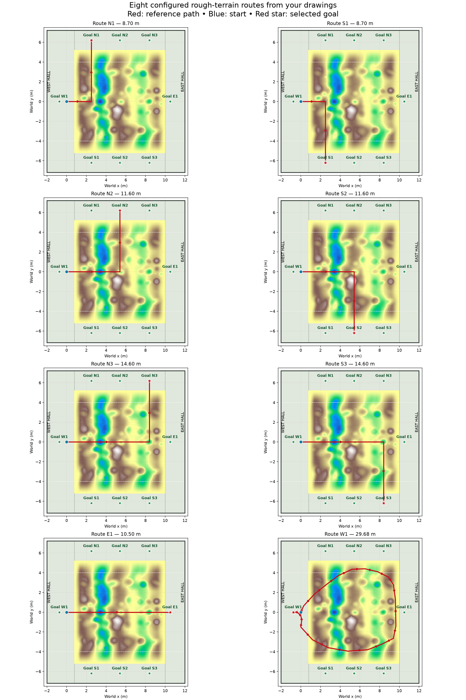

# Rough map: user-drawn goal trajectories

The routes are configured in `src/nino_rl/config/combined_rough_section.yaml`,
under `routes.definitions`. Coordinates are world metres; the configured start
is `(0, 0, 0)` and wheel odometry is reset to that origin. The eight unique
drawings are converted to the following references. Repeated N1/N3 images do
not create additional sampling weight.

| Route | Reference | Goal | Final heading | Length |
|---|---|---|---|---|
| N1 | East to x=2.5, then north | (2.5, 6.2) | +90° | 8.7 m |
| S1 | East to x=2.5, then south | (2.5, -6.2) | -90° | 8.7 m |
| N2 | East to x=5.4, then north | (5.4, 6.2) | +90° | 11.6 m |
| S2 | East to x=5.4, then south | (5.4, -6.2) | -90° | 11.6 m |
| N3 | East to x=8.4, then north | (8.4, 6.2) | +90° | 14.6 m |
| S3 | East to x=8.4, then south | (8.4, -6.2) | -90° | 14.6 m |
| E1 | Straight east | (10.5, 0) | 0° | 10.5 m |
| W1 | Upper terrain → clockwise east turn → lower terrain → west hall | (-0.75, 0) | 180° | 29.68 m |

The outer curve is approximated with explicit metre-coordinate waypoints.
The six L routes retain the drawn corner locations. The controller rounds
corners locally using a 0.45 m lookahead; it cannot make an instantaneous
90° change in heading.



## How training follows them

- Each episode selects one route. Balanced shuffled cycles include every
  route exactly once per eight selections; the robot starts at `(0, 0)` each time.
- An odometry-only pure-pursuit follower publishes linear and yaw references
  to the existing wheel-speed PI controller. Cruise is 0.4 m/s, turn speed
  floor 0.12 m/s, and yaw reference limit 0.8 rad/s. The effort controller
  scales both speed and yaw with the RL speed action.
- PPO retains the same three actions: speed scale, common torque residual,
  and differential torque residual. Left/right residuals remain independently
  expressible through their sum/difference. IMU, wheel measurements and terrain
  preview remain policy inputs. This is a path controller with RL residual
  adaptation; baseline steering alone is not evidence of learned adaptation.
- Read-only ordered path projection prevents a nearby return leg from being
  mistaken for the end of the route. Separate odometry and simulator-pose
  cursors keep simulator pose out of actor observations.
- Sequential position gates occur every metre and at drawn corners, with a
  0.6 m capture radius. Success requires all gates, remaining route distance
  ≤0.2 m, physical endpoint distance ≤0.2 m, and heading error ≤20°.
  Going directly to W1 does not succeed.
- Reward progress uses distance along the route. Goal braking also uses
  remaining route distance, so the loop is not discouraged from leaving W1
  initially. Existing IMU, slip, effort, action smoothness and failure terms remain.
- Target time is `max(45, 5 × route_length + 15)` simulation seconds.
  Deadline is `max(60, target + 40)` simulation seconds. These are episode
  budgets, not wall-clock training estimates. Long routes receive longer budgets.
- `episodes.jsonl` records route ID, actual goal, gate counts and time budgets.
  TensorBoard has `routes/<ID>/success`, path error, duration and gate counts.
  Evaluation `summary.json` includes results per route; `reference.csv` saves
  the selected reference for each evaluated episode.

Route gates measure trajectory coverage. They do not certify wheel contact
with each depression/mound. Compare RL with the same path-following PI baseline
on identical routes and report success, physical path error and IMU/torque metrics.

## Build and run

After stopping the previous rough Gazebo launch, rebuild and launch in terminal A:

```bash
cd ~/ninorobot
source /opt/ros/jazzy/setup.bash
source .venv/bin/activate
python -m colcon build --symlink-install --packages-select nino_description nino_rl
source install/setup.bash
export ROS_DOMAIN_ID=78
export NINO_ROS_DOMAIN_ID=78
export ROS_AUTOMATIC_DISCOVERY_RANGE=LOCALHOST
export GZ_PARTITION=nino_rough_78
ros2 launch nino_rl combined_rough_section_training.launch.py headless:=false
```

In terminal B use the same environment setup and isolation variables, then:

```bash
# Short plumbing check; 2048 steps is not a trained policy.
ros2 run nino_rl train --device cuda \
  --config src/nino_rl/config/combined_rough_section.yaml \
  --timesteps 2048 --check-env --output rl_runs/rough_drawn_routes_smoke

# New training task with all eight routes.
ros2 run nino_rl train --device cuda \
  --config src/nino_rl/config/combined_rough_section.yaml \
  --timesteps 500000 --output rl_runs/rough_drawn_routes

# Optional: train just one route by adding --route N1 (or another goal ID).
```

The map, route distribution and baseline steering differ from previous rough
runs. Start a new run; use `--init-model PATH.zip` only to warm-start a compatible
actor, with a fresh critic/optimizer. `--resume` requires the matching saved
configuration and training contract for this new task.

Evaluate baseline/PPO sequentially against the same routes:

```bash
ros2 run nino_rl evaluate_baseline \
  --config src/nino_rl/config/combined_rough_section.yaml \
  --episodes 24 --seed 10000 --output rl_runs/rough_routes_baseline

ros2 run nino_rl evaluate --device cuda --model PATH_TO_NEW_MODEL.zip \
  --config src/nino_rl/config/combined_rough_section.yaml \
  --episodes 24 --seed 10000 --output rl_runs/rough_routes_evaluation
```

24 episodes evaluates each route three times in round-robin order. Add
`--route W1 --episodes 3` to inspect only the long loop. Baseline and PPO must
use identical route selection/seed settings for comparison.
