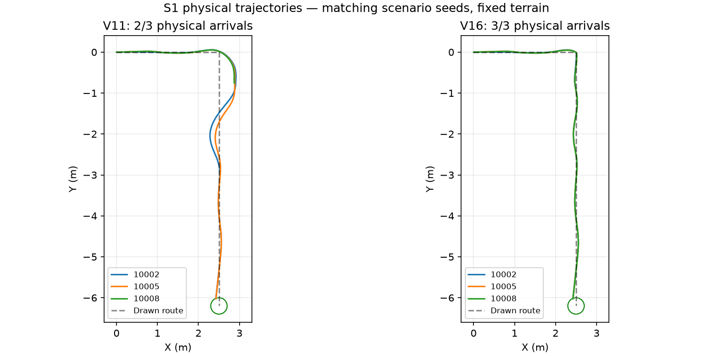

# Rough S1 turn and bounded recovery

## Change

The rough-only `rough_wall_recovery_v16` contract retains the v11 independent
wall-cloud localization, encoder history, IMU alignment, robot physics, fixed
terrain, drawn routes, reward weights and physical arrival scoring. It changes
the route controller. Live flat sources and the flat Optuna study are untouched.

On the explicitly configured S1 route, at a sharp drawn corner (at least
60 degrees), the controller approaches the
vertex within 0.10 m, stops translation, aligns to the outgoing segment within
0.08 rad, then resumes pursuit. Approach speed is capped at 0.18 m/s and yaw at
0.45 rad/s; alignment has an eight-second timeout. This prevents entering the
S1 depression sideways while still completing the turn. Normal pursuit also
reduces forward speed when the requested curvature exceeds yaw authority on
S1. N1 retains its previous moving-turn pursuit; E1 remains a straight route.

The fallback recovery compares independent localized XY displacement over a
0.5-second window with encoder wheel speed. A commanded stall lasting another
0.6 seconds triggers a straight backup at 0.08 m/s, bounded by 0.15 m or 2.5
seconds, followed by a one-second pursuit retry. There are at most three backup
attempts per episode. Attempts reset only at episode reset. Invalid localization
stops motion; excessive tilt during recovery or exhausted retries produces a
scored failure. The existing collision, rollover, off-path, wrong-direction and
deadline checks remain active.

Corner and recovery commands suppress PPO residual torque and temporarily use
full PI reference scaling. Outside those intervals the existing three policy
actions retain their meanings. This is a changed controller contract, requiring
actor initialization with a fresh critic and optimizer rather than an old
checkpoint resume. No ground-truth pose, terrain mesh or goal marker is used
to decide motion; ground truth remains independent evaluation/reward evidence.

## Why backup alone was insufficient

The preserved v13 S1 check reached 2/3 goals. Its failed episode executed all
three reverse commands, but the wheels rotated without translating the robot.
The stopped position was approximately (2.87, -0.75) m. Controller diagnostics
confirm executed reverse references of -0.08 m/s, zero residual torque and live
command heartbeats. This is physical grounding, not an ignored reverse command.
The bounded fallback shortened failure to 26.8 seconds; it did not free the robot.

The v14 curvature correction alone reached 1/3 goals. The failed runs grounded
at approximately (2.65, -0.80) m with about 18 degrees of roll. These rejected
profiles and their results are preserved. The final stop-and-align profile
changes how the robot enters the slope, rather than relying on torque once
ground contact has been lost.

V15 qualified S1 but attempted stop-and-align on N1 too. N1 reached 0/3 goals
because alignment timed out. The profile was rejected by the unchanged full readiness
gate (9/12 arrivals); its [complete evidence is preserved](rough_recovery_2026-10-09/v15_rejected.json).
V16 scopes alignment and curvature limiting to S1, while retaining bounded
stall recovery on every route. V16 was independently requalified on all
four profiles and passed all 12 physical arrival checks. V15 remains a rejected
diagnostic profile, not a training initialization contract.

## Measured final S1 check (V16)

| Seed | Physical arrival | Time | Physical path RMSE | Mean pose disagreement | Backups | Longest physical commanded stall |
|---|---:|---:|---:|---:|---:|---:|
| 10002 | Yes | 27.8 s | 0.02990 m | 0.00073 m | 0 | 0 s |
| 10005 | Yes | 27.7 s | 0.02952 m | 0.00249 m | 0 | 0 s |
| 10008 | Yes | 27.7 s | 0.02959 m | 0.00265 m | 0 | 0 s |

All ordered gates were visited and physical endpoint error remained below the
unchanged 0.20 m arrival radius. The older v11 profile reached 2/3 S1 goals,
including one arrival at 95.6 seconds and one timeout at 98.5 seconds; its
longest commanded stall was 87.6 seconds. The same scenario seeds were used,
but simulator execution can vary: these small checks establish a working
candidate, not a general reliability claim or an independent RL improvement.



## Complete PI qualification

| Profile | Physical arrivals | Mean time | Mean physical path RMSE | Longest physical commanded stall |
|---|---:|---:|---:|---:|
| E1 | 3/3 | 27.10 s | 0.02078 m | 0 s |
| N1 | 3/3 | 24.27 s | 0.11626 m | 0 s |
| S1 | 3/3 | 27.73 s | 0.02967 m | 0 s |
| E1 at 65% speed | 3/3 | 41.70 s | 0.02724 m | 0 s |

The strict PI readiness gate **passed**. Every episode visited all ordered route
gates, remained below the 0.20 m physical endpoint limit and the 0.10 m mean
pose-disagreement limit, and avoided prolonged commanded wheel-spin stalls.
Maximum motion-feedback lag was **0.024 s**, below the unchanged 0.040 s guard.
No recovery backups were needed in these 12 final checks. The diagnostic
supervisor completed normally and closed its owned rough simulator; the flat
study remained running.

N1's 0.116 m path RMSE still exceeds the curriculum promotion limit of 0.05 m.
Passing PI readiness permits a short pilot; it does not satisfy later PPO
promotion, prove generalization, or establish an RL improvement. The promotion
limit remains unchanged: N1 tracking must improve before advancing that stage.

**43 focused tests passed**, including recovery caps, independent sideways
translation, stop-and-align timeout, curvature preservation, failure scoring
and isolation of the S1 turn profile from N1.
The complete E1/N1/S1 plus slow-E1 qualification is recorded in the
[machine-readable report](rough_recovery_2026-10-09/comparison.json).

The backup fallback cannot guarantee escape after the chassis has grounded and
both drive wheels have lost useful contact. The successful final S1 checks
validate prevention; they needed zero backups. No rough Optuna run has been
started under this contract.

## Actor-initialized pilot — started 2026-10-09

The user authorized the short PPO pilot after PI qualification. The domain-78
runner is training **20,480 new steps on fixed E1**, using CUDA and a 2,048-step
rollout (ten PPO updates). Its actor source is the preserved
`rough_e1_imu_assisted_pilot/20261008-013943-771247/nino_ppo_final.zip`, which
itself contains 20,480 training steps. This is not an old-optimizer resume.

The trainer's `actor_transfer.json` verifies 13 copied actor tensors, a fresh
critic, fresh optimizer and a training counter starting at zero. Learning rate
is 0.00003, batch size 256, five update epochs and entropy coefficient 0.001.
Checkpoints are requested every 10,240 steps. The terrain remains fixed and no
N1/S1 training is included in this pilot's budget.

Run: `rl_runs/rough_wall_recovery_v16/curriculum/blocks/block_0000/train/20261009-101753-653623`.
Supervisor log: `rl_runs/rough_wall_recovery_v16/pilot.log`.
Live training log: `rl_runs/rough_wall_recovery_v16/curriculum/blocks/block_0000/train.log`.

At the first completed rollout (2,048 steps), five training episodes reached
the physical goal. Logged mean time was 40.4 seconds and mean physical path
RMSE about 0.0272 m. These are stochastic training observations, not a final
matched-seed evaluation or evidence that PPO beats PI. PI's earlier normal E1
check averaged 27.1 seconds, so the transferred actor currently drives slower.

After training, the runner automatically evaluates the saved policy on 20 E1
episodes and the matching PI controller on the same seeds (10000–10019).
Physical arrival, path error, completion time, vibration and slip remain the
comparison evidence. Stage promotion requires 95% physical success and at
most 0.05 m path RMSE with no rollovers. The pilot stops at its budget after
qualification; any additional route training or Optuna study is a subsequent
decision. The independent flat study remains running.

## Commands

Use the workspace and installed ROS environment:

```bash
cd ~/ninorobot
source /opt/ros/jazzy/setup.bash
source .venv/bin/activate
source install/setup.bash

python src/nino_rl/scripts/run_rough_localized.py prepare
python src/nino_rl/scripts/diagnose_rough_localized.py --full --slow-e1
python src/nino_rl/scripts/run_rough_localized.py gate
python src/nino_rl/scripts/report_rough_recovery.py
```

The diagnostic supervisor owns its domain-78 Gazebo instance and closes it on
exit. Stop any other rough instance before using these commands; the independent
domain-79 flat simulator can keep running. Completed matching normal-route
checks are preserved. The strict gate requires all 12 physical arrivals, pose
agreement, ordered gates, and no continuous physical commanded stall over two
seconds. It refuses PPO startup when these checks fail.

After the gate passes, the next step is a short E1 PPO pilot:

```bash
python src/nino_rl/scripts/run_rough_localized.py curriculum \
  --device cuda --timesteps 20480 --block-steps 20480 \
  --checkpoint-every 10240 \
  --init-model rl_runs/rough_e1_imu_assisted_pilot/20261008-013943-771247/nino_ppo_final.zip
```

Evaluate that pilot against the matching PI profile, introduce N1/S1 with E1
replay, then create a new focused Optuna study under the validated contract.
Do not append these controller/localization results to the old rough study.

The inherited localization profile uses an additional multi-layer LiDAR sensor
and known corridor walls. Real deployment requires equivalent sensor coverage;
the current 2D scanner alone does not provide that coverage. This controller
change does not solve arbitrary-map localization or demonstrate sim-to-real.
