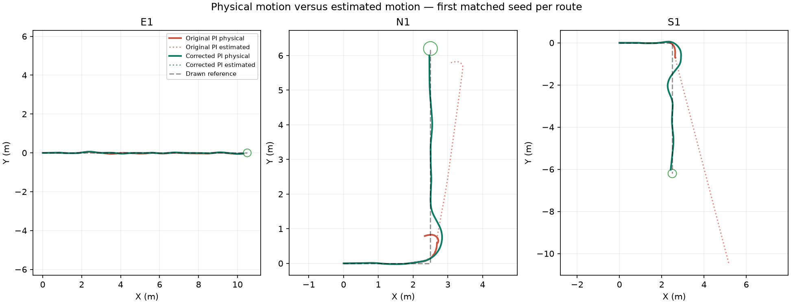

# Rough PI qualification comparison

| Route | Original / corrected arrivals | Physical endpoint (m) | Physical path RMSE (m) | Pose disagreement (m) | Time (s) |
|---|---:|---:|---:|---:|---:|
| E1 | 3/3 → 3/3 | 0.190 → 0.193 | 0.025 → 0.020 | 0.072 → 0.002 | 26.933 → 27.100 |
| N1 | 0/3 → 3/3 | 2.698 → 0.195 | 0.174 → 0.115 | 2.599 → 0.001 | 58.500 → 24.200 |
| S1 | 0/3 → 2/3 | 5.493 → 1.948 | 0.143 → 0.289 | 10.105 → 0.001 | 98.500 → 73.633 |

## Slow E1 crest check

Physical arrivals: 3/3 at 65% speed.
Mean pose disagreement: 0.0014 m.
Maximum motion-feedback lag: 0.022 s (unchanged limit: 0.040 s).

Crest coverage observations are included in comparison.json. The prior PPO and current PI have different motion profiles; these counts diagnose observability and do not compare policy quality.

PI qualification gate: **not passed**.

Both localization and turn requests changed together. These small matched-seed diagnostics do not establish which change contributes more or prove reliability on unseen terrain. Physical scoring and ordered route gates are unchanged.

[Measured values and source files](comparison.json)
