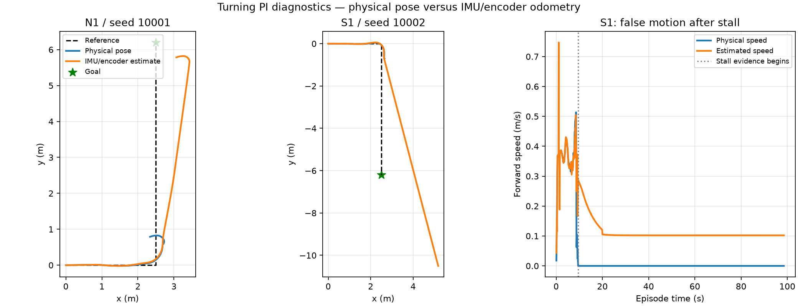

# Rough turning PI candidate: stall and false translation

Review of the nine fixed-map PI episodes run on 2026-10-09. These are baseline
diagnostics, not PPO training or Optuna trial observations. Original files and
models are unchanged; the flat continuation was still active during this review.

| Route | Physical successes | Mean physical endpoint error | Mean estimated/physical position disagreement |
|---|---:|---:|---:|
| E1 | 3/3 | 0.190 m | 0.072 m |
| N1 | 0/3 | 2.698 m | 2.599 m |
| S1 | 0/3 | 5.493 m | 10.105 m |

E1 mean time is 26.93 s and physical path RMSE 0.025 m. N1 has one timeout and
two wrong-direction terminations. S1 has three timeouts at 98.5 s. Console
`endpoint` and `path RMSE` values in this run describe estimated pose; the table
uses the separate `truth_*` measurements.

## Repeated S1 failure

All three S1 episodes stop physically near (2.65, -0.71 m) by about 9.5 s.
There are 891 control samples per episode with physical forward speed below
0.01 m/s and estimated forward speed above 0.05 m/s. During these samples the
mean physical speed is below 0.000001 m/s while estimated speed averages about
0.112 m/s. Samples are nominally 0.1 s apart.

For seed 10002, the final physical pose is (2.649, -0.708 m), while the assisted
estimate is (5.181, -10.499 m). The final controller diagnostics show:

- Requested motion: 0.12 m/s and -0.8 rad/s.
- Left wheel target/actual: 4.114 / 3.538 rad/s.
- Right wheel target/actual: -0.274 / -0.274 rad/s.
- Applied left/right effort: 0.573 / -0.005 Nm, below the 4 Nm limits.
- Command and policy freshness flags are both true; wheel feedback is available.
- Physical forward speed and physical yaw rate are both zero.

This confirms wheel rotation without chassis motion. It does not by itself
identify the exact contact cause: wheel unloading, loss of traction, caster or
chassis contact and terrain geometry need contact/visual evidence. It is not
evidence of a missing command or motors reaching their torque limits.

The estimator in `assisted_odometry.py` uses IMU orientation and pitch-projected
mean wheel displacement for translation. Its yaw agrees with physical yaw here,
but wheel displacement during the stall is still integrated as body travel.
The runaway position estimate then feeds the path follower. Ground truth is used
for scoring and this diagnosis, not as control localization.

## N1

N1 is less repeatable but has the same source of translation error. Seed 10001
stalls near (2.72, 0.63 m) while estimated y increases past 4 m. Seed 10004
recovers movement but physically stops near y=5.32 m when the estimator is near
y=6.16 m, leaving the robot about 0.89 m from the physical goal. This is a
premature estimated-stop failure as well as evidence of prior slip accumulation.

## Next work

1. Keep rough tuning and curriculum training held. The PI candidate is not qualified.
2. Inspect wheel/caster/chassis contact at the repeated S1 stall position.
3. Prepare a separate rough localization profile with an independent translation
   observation and explicit handling of slip/stall. Correct yaw alone cannot
   distinguish these wheel rotations from body movement.
4. Validate S1, N1 and E1 with PI under that new profile before curriculum training.
   Preserve 0.20 m physical arrival and ordered route gates. Controller/estimator
   changes belong in a new contract, not the original rough study.

The Axes3D warning is a Matplotlib installation issue affecting 3D plotting.
These evaluations completed and the diagnostic figure is 2D; the warning is not
the robot failure.

- [Measured data and source paths](analysis.json)
- [Physical versus estimated trajectories and S1 speed](physical_vs_estimated.png)

