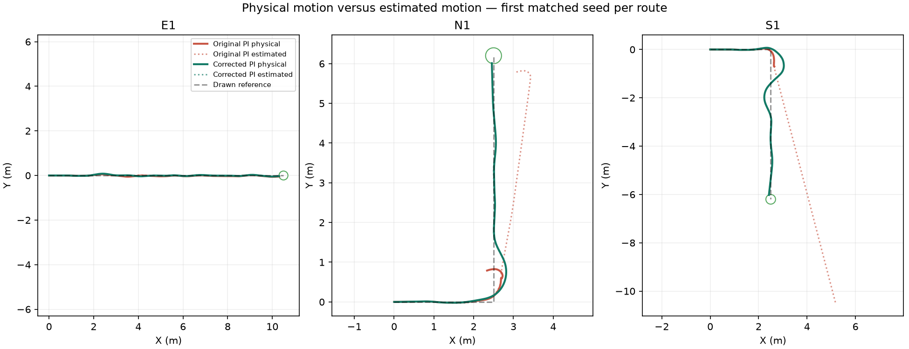

# Rough PI qualification comparison

| Route | Original / corrected arrivals | Physical endpoint (m) | Physical path RMSE (m) | Pose disagreement (m) | Time (s) |
|---|---:|---:|---:|---:|---:|
| E1 | 3/3 → 3/3 | 0.190 → 0.192 | 0.025 → 0.024 | 0.072 → 0.002 | 26.933 → 27.100 |
| N1 | 0/3 → 3/3 | 2.698 → 0.194 | 0.174 → 0.109 | 2.599 → 0.001 | 58.500 → 23.933 |
| S1 | 0/3 → 3/3 | 5.493 → 0.193 | 0.143 → 0.197 | 10.105 → 0.002 | 98.500 → 27.633 |

PI qualification gate: **passed**.

Both localization and turn requests changed together. These small matched-seed diagnostics do not establish which change contributes more or prove reliability on unseen terrain. Physical scoring and ordered route gates are unchanged.

[Measured values and source files](comparison.json)
